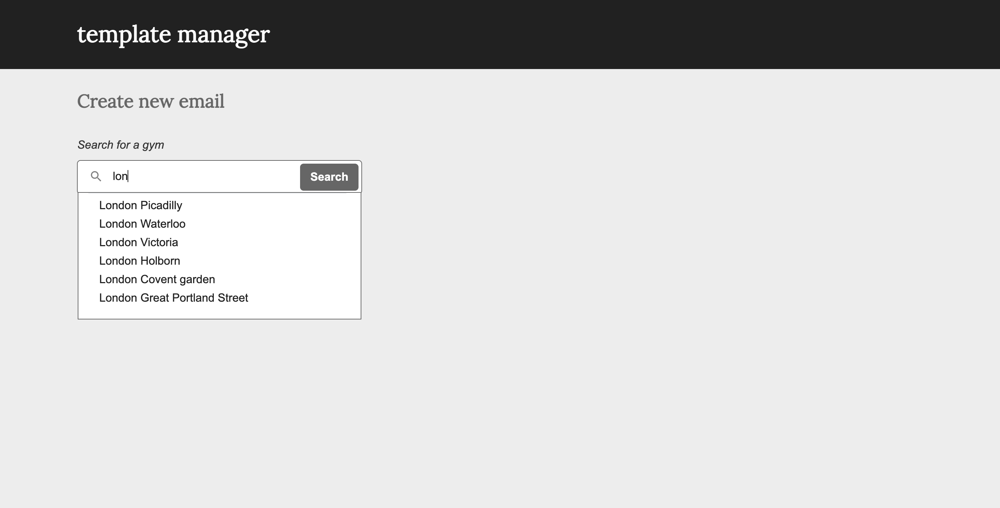

# Template manager

## Run the application

- Clone the project
- In the CLI, run "npm install", then "npm start"
- On the interface, start typing a letter in the searchbox, ex: "London"

## Tech Stack

- ReactJs
- Npm
- Git